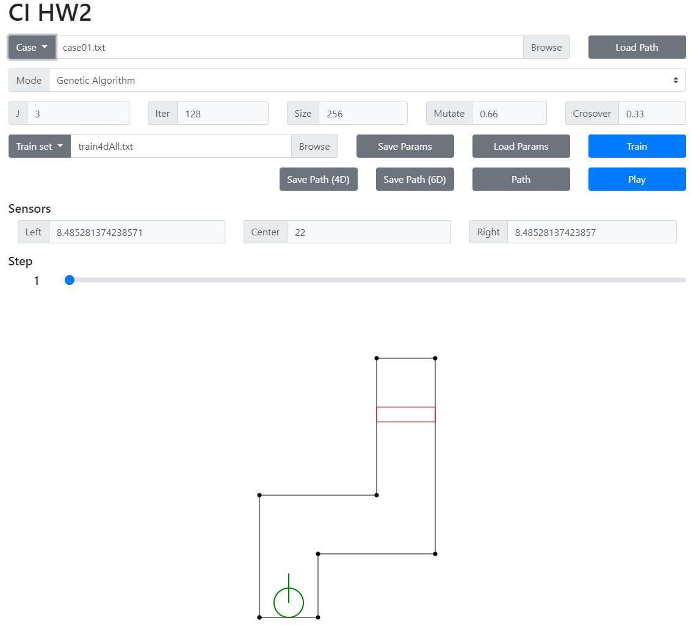
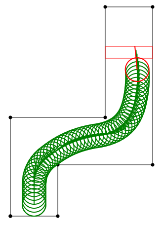
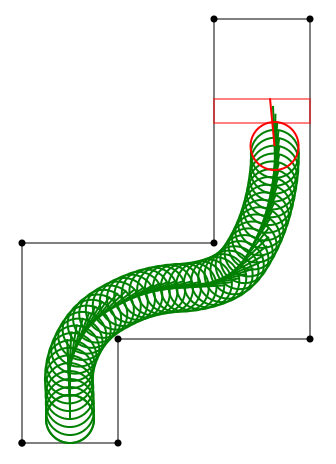

# 自走車模擬
中央大學 CE6126 計算型智慧 作業二

以基因演算法最佳化RBFN並用於自走車模擬

# 使用方法
1. 選擇軌道資料: 以下拉選單選擇預置軌道資料，或直接選擇檔案。
2. 選擇模式: 以下拉選單選擇使用模糊系統或基因演算法模式。
3. 若選擇基因演算法模式則可調整RBFN及演算法參數，包含：
     + J：RBFN 核心數
     + Iter：基因演算法迭代次數
     + Size：基因演算法個體數
     + Mutate：基因演算法突變機率
     + Crossover：基因演算法交配機率
4. 選擇訓練資料: 以下拉選單選擇預置訓練資料，或直接選擇檔案。
5. 調整完畢後按下 Train 按鈕開始訓練。
6. 訓練完畢後按下 Play 按鈕開始播放自走車移動軌跡。
7. 按下 Path 按鈕可顯示自走車移動軌跡。
8. 按下 Save Path 按鈕可儲存自走車移動軌跡。
9. 按下 Load Path 按鈕可載入自走車移動軌跡。
10. 按下 Save Params 按鈕可儲存 RBFN 參數。
11. 按下 Load Params 按鈕可載入 RBFN 參數。
12. 拖動 Step 滑條可顯示每一時刻的自走車位置。

# 基因演算法設計
## 基因
本程式採用實數型基因演算法。
## 選擇
本程式採用輪盤式選擇，個體複製進入交配池個數依適應值比例分配。除此之外，加入菁英機制，保留一個適應值最高的個體。
## 交配
本程式採用均勻交配，每一個基因都有相同機率與配偶交換。
## 突變
本程式採用均勻突變，每一個基因都有相同機率被設為範圍內的隨機值。

# 實驗結果
## train4dAll 訓練集
### 參數設定
+ RBFN核心數：3
+ 基因演算法迭代次數：64
+ 基因演算法個體數：256
+ 基因演算法突變機率：1
+ 基因演算法交配機率：1
### 實驗結果
本實驗在Intel® Core™ i5-4460 處理器 @ 3.40 GHz 上需訓練29.29秒，最終平均錯誤為0.109
### 輸出
+ 網路參數：RBFN_params_train4dAll.txt
+ 路徑：train4D_4D.txt, train4D_6D.txt

## train6dAll 訓練集
### 參數設定
+ RBFN核心數：3
+ 基因演算法迭代次數：64
+ 基因演算法個體數：256
+ 基因演算法突變機率：1
+ 基因演算法交配機率：1
### 實驗結果
本實驗在Intel® Core™ i5-4460 處理器 @ 3.40 GHz 上需訓練28.33秒，最終平均錯誤為0.113
### 輸出
+ 網路參數：RBFN_params_train6dAll.txt
+ 路徑：train6D_4D.txt, train6D_6D.txt
---
+ train4dAll 訓練集訓練之網路所產生之路徑
  
  
+ train6dAll 訓練集訓練之網路所產生之路徑
  
  

